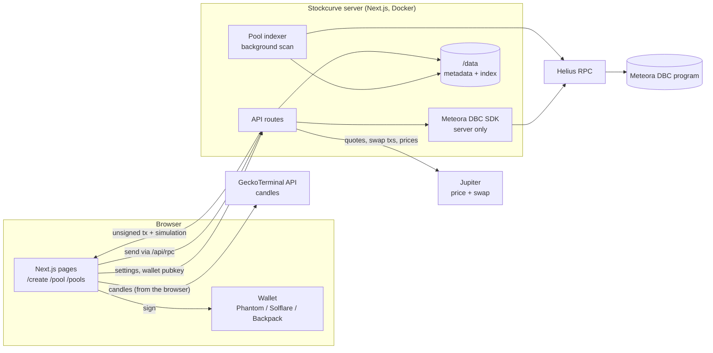
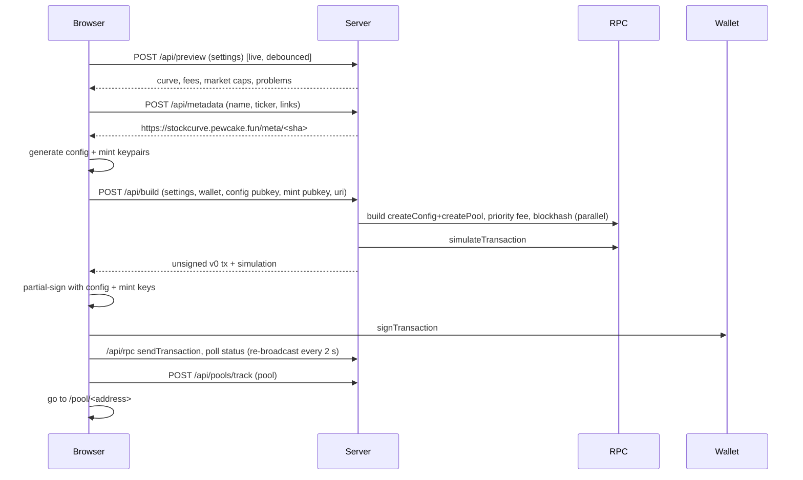

# 03 · Architecture

## Overview

Design rules:

- **The server never holds a key that can move user funds.** It builds unsigned transactions and simulates them. The browser (or agent) signs.
- **New account keys are generated where they are signed.** The config and mint keypairs for a launch are created in the browser; only their public keys go to the server.
- **The Meteora SDK and the RPC key stay on the server.** The browser talks to the RPC only through `/api/rpc`, an allow-listed, rate-limited proxy.
- **Everything is simulated on mainnet before a wallet prompt**, with plain-language errors (not enough SOL, slippage, paused stock).

## Code map

| Path | Role |
|---|---|
| `lib/stocks.ts` | Supported xStocks (client-safe) |
| `lib/settings.ts` | Launch settings, presets, checks (client-safe) |
| `lib/preset.ts` | Settings → SDK `ConfigParameters` (server + scripts) |
| `lib/server/solana.ts` | Shared connection, DBC client, TTL cache |
| `lib/server/stockInfo.ts` | Price, scaled-UI multiplier, pause, delegate, badge per stock |
| `lib/server/curve.ts` | Curve sampling, fee schedule, SDK validation |
| `lib/server/launch.ts` | Preview and build of the create-config-and-pool transaction |
| `lib/server/trade.ts` | Quotes and swap transactions (Jupiter or direct DBC), balances, fee claims |
| `lib/server/pool.ts` | Pool snapshot, decoded trades (execution and post-trade spot price) |
| `lib/server/chart.ts` | On-chain candles for pools GeckoTerminal has not indexed |
| `lib/client/gecko.ts` | GeckoTerminal candles and graduated-pool lookup, called from the browser |
| `lib/server/indexer.ts` | Background scan of all stock-quoted pools; instant tracking of new launches |
| `lib/server/metadata.ts` | Content-addressed token metadata storage |
| `components/Builder.tsx` | Config builder UI and launch flow |
| `components/PoolMonitor.tsx` | Pool page, fee claim |
| `components/TradePanel.tsx` | Buy / sell |
| `components/PoolChart.tsx` | Candlestick chart (lightweight-charts), timeframes, source selection |
| `components/PoolTable.tsx` | Index table |
| `scripts/probe.ts`, `simulate.ts`, `live.ts` | Go/no-go feasibility scripts |
| `scripts/agent.ts` | Agent CLI over the public API |
| `deploy/` | Compose file, build and push scripts |

## Flows

### Launch

### Trade

1. Debounced `POST /api/trade/quote` while typing.
2. On click, `POST /api/trade/build`: fresh quote; Jupiter `/swap/v1/quote` + `/swap/v1/swap` when Jupiter has a route, otherwise (stock only, pre-graduation) the SDK's `pool.swap`; mainnet simulation.
3. Wallet signs, browser sends through `/api/rpc` and confirms.

### Monitor

- `GET /api/pool/<address>`: snapshot (pool state, config, stock info, metadata, curve model, fee now). Cached 4 s server-side so many viewers cost one RPC read.
- `GET /api/pool/<address>/trades`: last 20 pool transactions, swap events decoded from DBC's `emit_cpi` inner instructions. Parsed transactions are memoised by signature; slow RPC lookups run in the background and the endpoint answers within ~2.5 s.
- Price chart: the browser asks `GET /api/pool/<address>/chart?tf=` for on-chain candles and pool details, then asks GeckoTerminal directly for USD candles. For a graduated pool it first looks up the token's most liquid non-DBC pool (its DAMM v2 successor) and charts that. GeckoTerminal candles win when they are at least as recent as the last on-chain swap; otherwise the on-chain candles are shown. On-chain candles use each swap's post-trade pool price (`next_sqrt_price` in the event), anchored at the curve's start price and the current price, converted at today's stock price.

  Why not embeds: DexScreener indexes these pools but has no USD price for xStock-quoted pairs, so its embed never finishes loading; and GeckoTerminal's free API throttles the server's IP (shared with Pewcake), while browsers each get their own allowance (CORS is open).

### Index

Every 30 minutes: for each stock, `getProgramAccounts` on DBC configs with `quote_mint` = stock (offset 8, size 1048), then pools per config (config at offset 72), then Metaplex names 100 at a time. ~3 RPC calls per second, persisted to `/data/pool-index.json`. `POST /api/pools/track` adds a single pool immediately after a launch.

## API reference

All responses are JSON. Errors: `{ "error": "message" }` with a 4xx/5xx status. Every endpoint is rate-limited per IP.

| Method | Path | Body / query | Returns |
|---|---|---|---|
| GET | `/api/health` | | `{ ok, slot }` |
| GET | `/api/stocks` | | stocks with price, multiplier, pause, delegate, badge |
| POST | `/api/preview` | partial `LaunchSettings` | `{ ok, problems[], stock, curve, fees, startFdvUsd, graduationFdvUsd }` |
| POST | `/api/metadata` | `{ name, symbol, description?, image?, website?, x?, stock? }` | `{ uri, document }` |
| GET | `/meta/<id>` | | the metadata JSON (immutable cache) |
| POST | `/api/build` | `{ settings, wallet, config, baseMint, name, symbol, uri }` | `{ tx, pool, lastValidBlockHeight, simulation }` |
| GET | `/api/pool/<address>` | | `PoolSnapshot` |
| GET | `/api/pool/<address>/trades` | | `{ trades[], pending }` |
| GET | `/api/pool/<address>/chart` | `?tf=5m|15m|1h|4h|1d` | `{ pool, baseMint, isMigrated, candles[], note }` (on-chain candles) |
| POST | `/api/trade/quote` | `{ pool, side, asset: SOL/USDC/STOCK, amount, slippageBps, route?: auto/dbc }` | `{ route, routeLabel, outAmount, minOut, priceImpactPct }` |
| POST | `/api/trade/build` | quote body + `wallet` | quote + `{ tx, lastValidBlockHeight, simulation }` |
| GET | `/api/balances` | `?wallet=&pool=` | `{ sol, usdc, stock, token }` |
| POST | `/api/claim` | `{ pool, wallet }` | `{ tx, claims[], lastValidBlockHeight, simulation }` |
| GET | `/api/pools` | | `{ pools[], updatedAt, scanning, progress }` |
| POST | `/api/pools/track` | `{ pool }` | the indexed pool |
| POST | `/api/rpc` | JSON-RPC | proxied to Helius (allow-listed methods only) |

## Security model

| Concern | Handling |
|---|---|
| Custody | None. Server returns unsigned transactions; wallets sign |
| RPC key exposure | Key only in the server env; browser uses an allow-listed proxy with per-IP limits |
| Malicious transaction swapping | The wallet shows the full transaction; Stockcurve does not use blind-signing flows. The launch transaction's only signers are the user and two keys the browser just generated |
| Metadata tampering | Documents are content-addressed (sha256) and never modified; on-chain metadata is immutable |
| Localhost metadata | Refused at build time (would be a permanently broken link) |
| Oversized transactions | Refused before simulation (1232-byte limit; metadata link ≤ 80 chars) |
| Abuse / scraping | Per-IP rate limits on every route; the indexer is paced |
| Container blast radius | Separate compose project, 320 MB memory cap, read-only app mount, own data volume |
